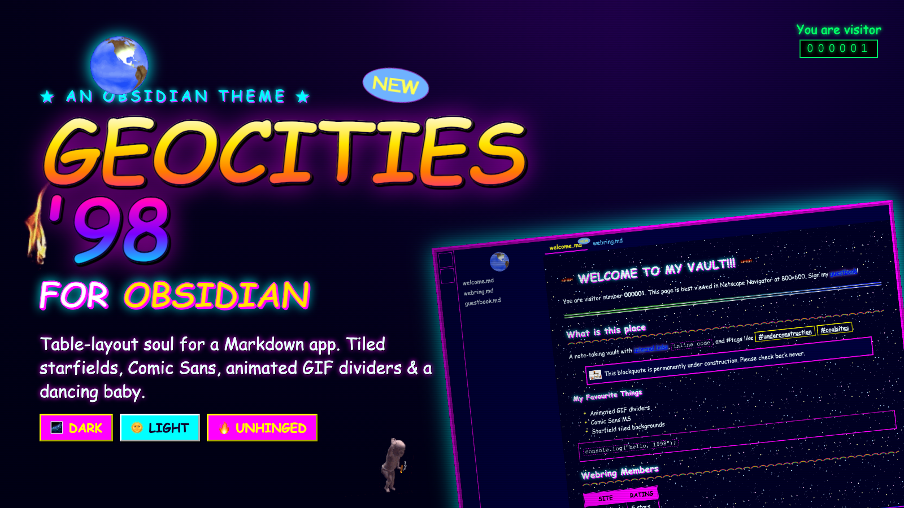

# 🌐 GeoCities '98 — an Obsidian theme 🌐

### ✨ Welcome 2 my theme!!! You are visitor number `000001` ✨

```
  +----------------------------------------------------+
  |  T H I S   V A U L T   I S   U N D E R             |
  |         🚧  C O N S T R U C T I O N  🚧            |
  |    (since 1997 — please check back never)          |
  +----------------------------------------------------+
```

Ever looked at your beautiful, minimal, tastefully-monochrome note-taking app and
thought: *what this needs is a tiled starfield, Comic Sans, and a spinning globe?*

**Congratulations.** You have found the right web page. 🔥

GeoCities '98 drags Obsidian back through a 56k modem to the golden age of the
personal homepage. Light **and** dark. Best viewed in Netscape Navigator at
800×600.



---

## 🎇 What u get (WOW!!)

- 🌌 **DARK MODE** — a genuine tiled starfield on midnight `#000022`, glowing
  Comic Sans headings, neon cyan + magenta links, and gold H1s that SCREAM.
- 🌞 **LIGHT MODE** — pale-yellow confetti wallpaper, navy Comic Sans, and a
  web-safe colour palette cranked to "my first homepage."
- 〰️ **Animated GIF dividers** where your boring `<hr>` used to be.
- 🚧 **Blockquotes are under construction.** All of them. Forever.
- 🌍 **A spinning globe** sits proudly atop your file list.
- 🔢 **A hit counter and a flame** live in your status bar. You've earned them.
- 💾 **Garish tag pills**, Win98 bevelled buttons, ✦ sparkle bullet points.
- 📣 **A real scrolling `[!marquee]` callout.** Type:
  ```
  > [!marquee]
  > Sign my guestbook! Best viewed in Netscape at 800x600!
  ```
  and get an honest-to-god CSS ticker banner. No JS. Some things never left 1998.

Every GIF and tile is baked into `theme.css` as a `data:` URI, so the whole thing
is **one self-contained file** — nothing hotlinks, nothing rots, works offline.
No FTP required. 📼

GIFs lovingly exhumed from the Internet Archive's
[gifcities.org](https://gifcities.org), the real ashes of the original GeoCities.

---

## 💿 Install (manual — the way God and 1998 intended)

```bash
# copy the two files into your vault
cp theme.css manifest.json "<your vault>/.obsidian/themes/GeoCities 98/"
```

Then, inside Obsidian:

1. **Settings → Appearance → Themes → Manage → GeoCities 98**
2. Flip **Settings → Appearance → Base color scheme** between **Light** and **Dark**
   to switch flavours. Both are fully supported. 🎨

---

## 🛠️ Build (4 the webmasters)

The GIFs and tiles live in `assets/`. Edit **`theme.src.css`** — never `theme.css`
directly — then re-bake:

```bash
python3 build.py
```

This inlines every asset from `assets/` into `theme.css` as base64 `data:` URIs.
Requires Python 3 with Pillow (`pip install pillow`) only if you regenerate the
starfield tiles.

```
theme.src.css   ← you edit this
build.py        ← inlines assets → theme.css
theme.css       ← the finished, self-contained theme (~230 KB)
manifest.json   ← name + version for Obsidian
assets/         ← the raw GIFs + generated tiles
screenshot.png  ← 512×288 for the theme store
```

---

## 📜 License

MIT — see [LICENSE](LICENSE). Steal it, remix it, put it on your Angelfire page.

---

```
       ★ ﾟ｡⋆  thanx 4 visiting — dont forget 2 bookmark!  ⋆｡ﾟ★
             [ Netscape Now! ]   [ Made with Notepad ]
```
